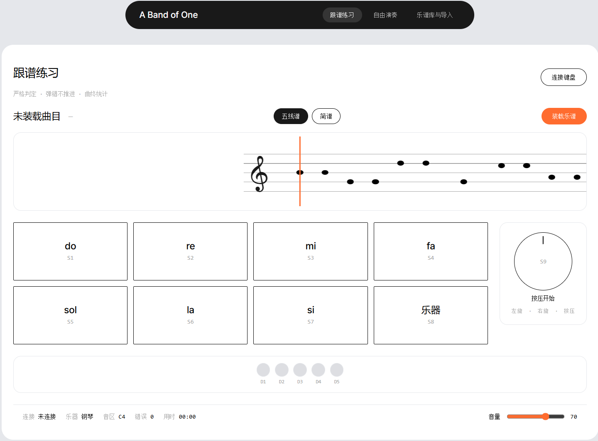
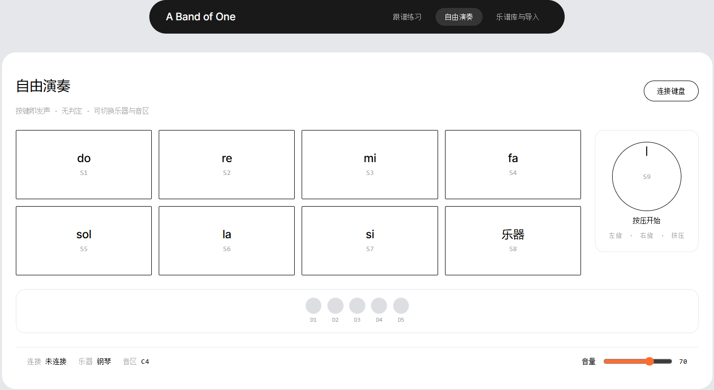
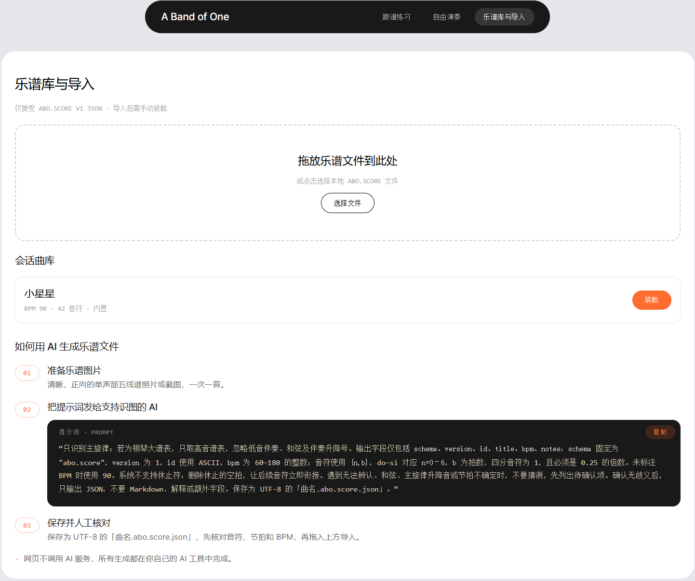
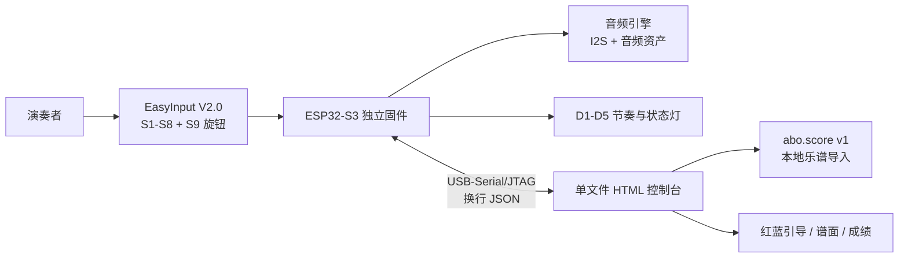

# A BAND OF ONE · 一个人的乐队

基于 EasyInput V2.0 / ESP32-S3 的三乐器跟谱演奏器：8 个实体键提供 7 个音级，S8 循环切换钢琴、弦乐和单簧管；网页控制台通过 ESP32-S3 内建 USB-Serial/JTAG 负责选曲、模式、音量、谱面和成绩显示。

> 板端负责时间、声音和判定；网页负责看见、装载和控制。

## 网页界面预览

下面是当前网页的三个主要页面：跟谱练习、自由演奏、乐谱库与导入。

<table>
  <tr>
    <td></td>
    <td></td>
    <td></td>
  </tr>
  <tr>
    <td align="center">跟谱练习</td>
    <td align="center">自由演奏</td>
    <td align="center">乐谱库与导入</td>
  </tr>
</table>

界面同时呈现谱面、8 个实体控制、S9 旋钮、D1–D5 灯光状态、连接状态、音区、错误数、用时和音量反馈。截图位于 [`docs/assets/screenshots/`](docs/assets/screenshots/)。

## 项目是什么

A Band of One 不是把按键事件转发给电脑后才发声的键盘，也不是只在浏览器里运行的音乐小游戏。断开电脑后，ESP32-S3 仍负责按键扫描、音频渲染、严格拍长和灯光状态；连接电脑后，浏览器成为乐谱和演奏状态的可视化控制台。

## 当前能力

- **三种乐器**：钢琴、弦乐、单簧管；覆盖 21 个目标音，共 63 个乐器/音区组合。
- **两种模式**：自由演奏不判定；跟谱演奏由板端严格判定，错误不推进时间轴。
- **网页控制台**：Web Serial 握手、乐谱选择与导入、红蓝按键引导、中央固定指针、成绩统计、音量反馈和断线清理。
- **实体交互**：S1–S7 演奏，S8 循环切换乐器，旋钮旋转调音区，旋钮按压开始/暂停/继续。
- **乐谱格式**：本地 UTF-8 `.abo.score.json`，协议版本 `abo.score v1`，支持校验、预览和分片下发。
- **当前验证**：控制台测试 16/16 通过，内嵌脚本解析 2/2 通过，EasyInput V2.0 实机主流程已验收。

## 系统结构



板端是演奏状态的权威来源：发声、严格判定、拍长、节奏灯、模式、谱面 CRC 和成绩都由固件维护。网页不自建第二个节拍器，不替代实体输入，也不直接判定音符。

## 阶段路线

| 阶段 | 目标 | 当前产出 |
|---|---|---|
| P0' | 安全上电与硬件边界 | GPIO8 电源域、BOOT、USB、LED、I2S 和启动声边界已保留 |
| P1' | 独立音频引擎 | 三种乐器、源根音、实时变调、持续音与释放阶段 |
| P2' | 双模式状态机 | 自由/跟谱、严格判定、暂停即 Standby、实体旋钮语义 |
| P3' | 网页控制台 | USB-Serial/JTAG、乐谱事务、红蓝引导、谱面游标、成绩与音量 |

## 快速开始：先运行网页

### 环境

- Windows、macOS 或 Linux；
- Chrome 或 Edge，需支持 Web Serial；
- Python 3（仅用于启动本地静态 HTTP 服务）；
- 已连接的 EasyInput V2.0 / ESP32-S3 设备和数据 USB 线。

在仓库根目录运行：

```powershell
python -m http.server 8800
```

然后打开：

<http://127.0.0.1:8800/console/index.html>

点击“连接键盘”，在浏览器串口选择窗口中选择设备。完成 `ping → hello/state` 握手后，可以选择内置曲目或导入 `.abo.score.json`。

网页控制台没有 npm、React、Vue、Next.js 或其他前端构建依赖；它是单文件 HTML、CSS 和原生 JavaScript。`console/index.test.mjs` 使用 Node.js 内置测试能力。

## 快速开始：构建固件

### 版本与路径

- 芯片：ESP32-S3；开发板：EasyInput V2.0。
- ESP-IDF：**5.5.5**。
- 编译必须在纯 ASCII 路径进行，例如 `C:\esp-work\a-band-of-one`；不要直接在包含中文或空格的项目路径下构建。
- `A Band of One` 是独立固件，不启动 USB HID、BLE HID 或 EasyInput App 产品链路。

将 `firmware/course-motherboard/` 复制到纯 ASCII 路径后，在 ESP-IDF 5.5.5 环境中运行：

```powershell
idf.py --version
idf.py build
```

默认只构建，不自动烧录。烧录前必须确认板型、USB 端口和 BOOT 状态；本项目任何流程都禁止执行 `erase_flash`。

### 板级安全边界

| 引脚 / 部件 | 约束 |
|---|---|
| GPIO8 | LED、麦克风和扬声器共用的高有效电源域，不是普通灯光开关 |
| GPIO12 | WS2812 数据脚 |
| GPIO19/20 | ESP32-S3 原生 USB D-/D+，用于 USB-Serial/JTAG |
| GPIO0 | BOOT，不是第 9 个业务按键 |

课程 EasyInput 镜像与 A Band of One 不在同一镜像中。切换镜像需要重新烧录对应版本，但不执行全盘擦除。

## 测试

网页测试无需安装第三方 npm 包：

```powershell
node console/index.test.mjs
```

正式音频资产还提供 Python 标准库转换器和资产清单。构建前请阅读：

- `firmware/course-motherboard/abo_assets/README.md`
- `firmware/course-motherboard/abo_assets/delivery/ATTRIBUTION.md`
- `firmware/course-motherboard/abo_assets/delivery/manifest.json`

静态检查、宿主测试、ESP-IDF 构建、烧录成功和实板功能正常是不同证据，不能互相替代。

## 目录结构

```text
.
├─ console/                         单文件控制台、谱面样例、测试和诊断页
├─ firmware/course-motherboard/     ESP-IDF 固件、音频资产、依赖和许可证
├─ a-band-of-one-prd/               PRD 与可玩 HTML 原型
├─ docs/                            技术方案、控制台框架和最终交接
└─ flow/                            目标、计划和公开状态
```

## 文档入口

- [PRD 与可玩原型](a-band-of-one-prd/a-band-of-one-prd.html)
- [技术方案](docs/技术方案.md)
- [Web 控制台功能框架](docs/Web控制台功能框架.md)
- [最终交接与验收索引](docs/最终交接.md)
- [公开状态](flow/公开状态.md)
- [固件工程说明](firmware/course-motherboard/README.md)
- [第三方声明](THIRD_PARTY_NOTICES.md)

## 硬件与开发环境来源

本项目的硬件与开发环境搭建，参考并建立在 [Zhaohan-Wang老师的 EasyInput 项目体系](https://github.com/Zhaohan-Wang) 之上。下表中的 `easyinput-beatbox` 是 Zhaohan-Wang老师的公开参考项目；`easyinput-board-cy`、`esp-idf-cy` 和 `easy-input-maker` 用于继续核对硬件事实、搭建开发环境、编译固件并复用已验证的平台层。本项目在此基础上实现 A Band of One 自己的音频、模式、乐谱和网页控制台功能。

| 来源 | 地址 | 参考内容 |
|---|---|---|
| `easyinput-board-cy` | [GitHub](https://github.com/CY-CHENYUE/easyinput-board-cy) | EasyInput 板型、GPIO、按键、BOOT、电源、USB、音频事实和安全边界。 |
| `esp-idf-cy` | [GitHub](https://github.com/CY-CHENYUE/esp-idf-cy) | ESP-IDF 环境检查、固件编译、设备识别；烧录与串口操作必须在确认后执行。 |
| `easy-input-maker` | [GitHub](https://github.com/CY-CHENYUE/easy-input-maker) | EasyInput Maker 完整固件工程；是本项目复用已验证 GPIO8、按键、旋钮、LED、I2S/音频和分区边界的平台层来源。 |
| Zhaohan-Wang老师的项目（来源） | [easyinput-beatbox](https://github.com/Zhaohan-Wang/easyinput-beatbox) | Zhaohan-Wang老师的公开项目；参考“先独立出声，再建立时间轴，最后接入网页控制台”的阶段组织方式，不复制其代码。 |

## 软件框架与 API 来源

| 技术 | 官方参考 | 本项目使用方式 |
|---|---|---|
| ESP-IDF 5.5.5 | [ESP-IDF v5.5.5](https://docs.espressif.com/projects/esp-idf/en/v5.5.5/) | CMake 工程、`idf.py` 构建、ESP32-S3 外设、分区和固件环境。 |
| USB-Serial/JTAG | [ESP32-S3 USB Serial/JTAG Console](https://docs.espressif.com/projects/esp-idf/en/latest/esp32s3/api-guides/usb-serial-jtag-console.html) | 作为网页控制通道和串口控制台；不把 TinyUSB CDC 作为产品协议。 |
| Web Serial API | [MDN Web Serial API](https://developer.mozilla.org/en-US/docs/Web/API/Web_Serial_API) | 浏览器串口打开、换行 JSON 读写、握手、状态同步和断线清理。 |
| HTML / CSS / JavaScript | [WHATWG HTML](https://html.spec.whatwg.org/) | 单文件、零构建依赖的控制台 UI。 |
| Node.js Test Runner | [Node.js test runner](https://nodejs.org/api/test.html) | `console/index.test.mjs` 的网页契约测试。 |
| CMake | [CMake Documentation](https://cmake.org/cmake/help/latest/) | 固件和宿主测试的构建组织。 |
| Mermaid | [Mermaid](https://mermaid.js.org/) | 仅用于 PRD 局部方案图；运行控制台不依赖 Mermaid。 |

## 音频来源

固件正式音频由 23 枚源根音及转换后的交付资产组成：14 枚 EIAD-v1 加 9 枚 PCM16LE-v1，目标为 48 kHz、单声道、16-bit。

| 乐器 | 来源 | 许可 | 正式根音 |
|---|---|---|---|
| 钢琴 | [FreePats Upright Piano KW](https://freepats.zenvoid.org/Piano/acoustic-grand-piano.html) | CC0 1.0 | B2 / F#3 / C4 / F#4 / C5 / F#5 / C6 |
| 弦乐 | [VSCO-2-CE](https://github.com/sgossner/VSCO-2-CE)，Solo Violin `Arco Vib f` | CC0 1.0 | G3 / C4 / E4 / G4 / C5 / E5 / A5 |
| 单簧管 | [nbrosowsky/tonejs-instruments](https://github.com/nbrosowsky/tonejs-instruments) | 项目级 CC BY 3.0 声明 | D3 / F3 / A#3 / D4 / F4 / A#4 / D5 / F5 / A#5 |

逐文件来源、归属、转换参数和 SHA-256 以 [`ATTRIBUTION.md`](firmware/course-motherboard/abo_assets/delivery/ATTRIBUTION.md) 与 [`manifest.json`](firmware/course-motherboard/abo_assets/delivery/manifest.json) 为准。任何新增或替换音频都必须同步更新来源和哈希记录。

## 当前范围外

以下方向不属于当前 MVP，后续需要单独立项和验证：

1. 单簧管音质优化；
2. 复音 / 和弦；
3. 更多导入格式；
4. 新用户教程；
5. 五线谱识别与样式优化。

当前也不包含网页内 AI、API Key、第三方上传、MIDI/MusicXML/PDF/图片识谱和 Electron 打包。

## 许可证

- 项目自有材料的许可证见 [`LICENSE`](LICENSE)。
- 固件依赖和第三方组件见 [`THIRD_PARTY_NOTICES.md`](THIRD_PARTY_NOTICES.md)。
- 音频素材继续遵守各自来源许可，不能只分发转换文件而删除归属和哈希记录。
- 发布新增图片、字体、模型或音频前，必须先确认所有权和再分发条件。

## 安全提示

这是一个真实硬件项目。不要在未经确认的情况下烧录、擦除 Flash、改动 GPIO8、BOOT、USB 或音频电源链路；不要把 USB 串口控制端口暴露给不可信网页。发现硬件型号、端口或固件镜像不确定时，先停止并核对文档。
