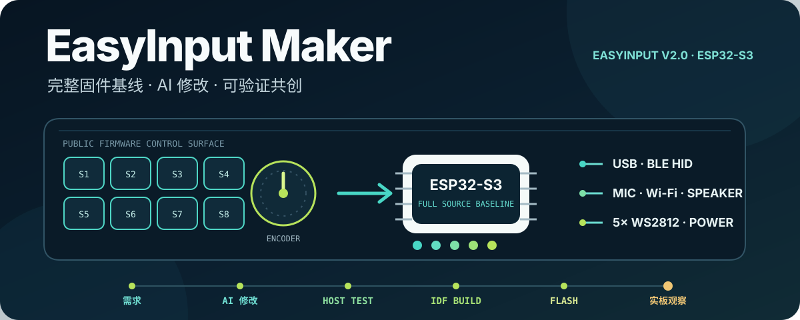

# EasyInput Maker



**从一份完整功能基线开始，让 AI 帮你增加下一项硬件能力。**

EasyInput Maker 是面向 **EasyInput V2.0 / ESP32-S3** 的 WaytoAGI 社区固件。它保留按键、旋钮、灯光、USB/BLE HID、电池、麦克风与声音资源等现有能力，同时提供公开硬件边界、测试入口和 AI/Vibe Coding 教学路径。

> 当前状态：当前公开候选已在 EasyInput V2.0 实板完成联合功能测试；按键、编码器、灯光、USB/BLE、麦克风、扬声器、电源与启动恢复等主流程观察正常。构建、烧录与本次实板观察仍是不同证据。
>
> 本仓库交付固件源码和音频控制协议参考，不包含桌面 companion 应用；麦克风 Wi-Fi 上行需要兼容的本地 companion 配合，并且只适合受信任的本地网络。

> **课程分支提示**：你正在查看 `course/host-action-v1-starter`。这个起点保留当前 BLE 修复和其他公共能力，但故意不包含 Host Action v1；请按课程节点自己实现，不要把它当成完整发布固件。

## 先看当前证据

- **公开源码与依赖｜完整功能基线**：锁定依赖和 WaytoAGI 出厂提示音均已纳入；这不是另做的一套精简教学固件。
- **宿主测试｜57 / 57 通过**：starter 的纯逻辑、协议、配置、输入、状态与资源合同通过当前测试；完整 `main` 另有 3 项 Host Action 专项测试。
- **ESP-IDF 构建｜5.5.5 / ESP32-S3 默认构建通过**：当前源码和锁定依赖可以生成固件镜像。
- **EasyInput V2.0 实板联合测试｜通过**：当前公开候选已完成主功能实板测试并观察正常。

测试覆盖、资源指纹和构建状态见 [源码与资源清单](docs/release/source-inventory.md)；逐项功能与专项验证状态见 [功能状态清单](docs/release/functional-parity.md)。静态检查、测试、构建、烧录和实板观察是不同证据，不能互相替代。

## 先选择你的使用方式

- **直接使用完整固件**：使用 `main` 或固定标签 `course-host-action-v1-complete-v1`；它包含稳定的 USB／BLE 配置底座和 Host Action v1，不需要提交 Issue 或 Pull Request。
- **从课程起点实现“打开应用”**：使用 `course/host-action-v1-starter` 或固定标签 `course-host-action-v1-start-v1`；它保留与完整固件一致的 BLE 修复和其他公共能力，只拿掉 Host Action 的实现与答案型测试。
- **自己完成其他课程练习**：下载源码后创建自己的本地练习分支，让 AI 修改、测试、构建并在自己的开发板上验证；修改可以只保留在本地，不要求上传或贡献给社区。
- **参与社区共创**：只有想法或发现问题时提交 Issue；已经完成并希望贡献的修改，通过个人 Fork、功能分支和 Pull Request 交给维护者审核。

如果一开始就准备贡献代码，建议先 Fork 再下载自己的 Fork。如果已经从官方仓库下载并做出了修改，也不需要重做；可以按照 [中文共创与提交教程](docs/contributing/how-to-contribute.md#已经下载官方仓库并修改后来想贡献) 把现有修改安全地转到自己的 Fork。

Host Action 课程起点不是过时固件：BLE 配置持久化、编码器、音频、电源和硬件安全边界继续与公共基线同步。产品专属 OTA、签名和部署工具不属于 Maker 或本课程，因此不会出现在上述任一分支。

## 配套 Agent Skills

下面两个独立 Skill 可以让 AI 更准确地理解开发板并完成 ESP-IDF 操作；它们是可选辅助工具，不是构建本固件的强制依赖：

- [`easyinput-board-cy`](https://github.com/CY-CHENYUE/easyinput-board-cy)：提供 EasyInput V2.0 的板型身份、GPIO、BOOT、共享电源、板载外设和硬件安全边界；适合在修改引脚、灯光、音频、电源或睡眠功能前加载。
- [`esp-idf-cy`](https://github.com/CY-CHENYUE/esp-idf-cy)：帮助 AI 在 macOS / Windows 上侦察或准备 ESP-IDF 环境，完成构建、设备验身、经确认后的安全烧录、串口验证和排错。

推荐组合是：本仓库提供要修改的完整固件，`easyinput-board-cy` 提供不能破坏的硬件事实，`esp-idf-cy` 负责把环境、构建和烧录推进到可验证结果。两个 Skill 独立安装并分别遵守各自仓库的许可证。

## 第一次成功：先构建固件

只想直接使用或在本地练习时，准备 ESP-IDF `5.5.5`，然后运行：

```bash
git clone https://github.com/CY-CHENYUE/easy-input-maker.git
cd easy-input-maker
idf.py --version
idf.py build
```

看到 `Project build complete` 即表示源码、锁定依赖和本机工具链已经完成一次构建。ESP-IDF 的环境激活方式因系统和安装方式而异；完整准备、宿主测试、烧录和恢复步骤见 [开始使用](docs/getting-started/README.md)。

烧录会覆盖开发板上已有固件，因此本项目不把 `flash` 塞进默认复制命令。请先核对目标设备，再按 [烧录与恢复](docs/getting-started/flash-and-recovery.md) 操作。

## 用 AI 完成第一个修改

最适合入门的任务是“调整灯光亮度”：它有立刻可观察的结果，又能学习如何把业务改动限制在正确硬件边界内。

```text
请先阅读 AGENTS.md、docs/hardware/easyinput-v2-safety.md 和
docs/teaching/ai-vibe-coding.md。为 5 颗 WS2812 增加统一的可配置亮度比例，
不要改 GPIO、RMT 时序、GPIO8 电源生命周期或 BOOT 行为。先增加可在电脑运行的
纯逻辑测试，再执行全部宿主测试和 ESP-IDF build；不要自动烧录。
```

AI 写代码不等于结果已经正确。你仍需要查看改动、确认测试与构建证据，并在烧录前明确选择自己的开发板。完整练习见 [AI / Vibe Coding 教学路径](docs/teaching/ai-vibe-coding.md)，Agent 的项目入口见 [AI_DEVELOPMENT.md](AI_DEVELOPMENT.md)。

## 完整功能基线包含什么

- **输入**：8 个独立按键、旋转编码器与按压；
- **反馈**：5 颗 WS2812、独立状态灯、输入、连接与 Agent 状态效果；
- **连接**：USB HID、BLE HID、本地配置与状态通道；为兼容既有设备与 companion，USB/BLE 设备身份保持 `EasyInput AI`；
- **Host Action v1**：由兼容的 EasyInput App 建立本机应用映射，固件只保存和发送动作 UUID；课程起点分支故意不含该实现；
- **音频**：板载麦克风采集、Wi-Fi UDP 上行、扬声器播放、声音资源同步、A/B 存储与 WaytoAGI 出厂提示音；
- **电源**：电池采样、供电状态、睡眠与唤醒策略；
- **AI 共创**：公开硬件边界、代码入口、验证命令和第一个灯光练习。

## 麦克风网络控制的使用边界

当前兼容协议使用 UDP，并要求控制包来源 IP 与已配置的 `audio_host` 解析地址一致；协议中的 token 字段暂未提供密码学认证。该能力只适合受信任的本地网络，不应直接暴露到互联网或不可信局域网。兼容端还可以从同一已配置主机地址发送配置 JSON，因此配置端与网络边界必须由使用者共同保护。

消息格式、兼容要求和安全边界见 [音频控制协议 v1](docs/security/audio-control-v1.md)。

## 改硬件功能前先读这些边界

- 目标板只有一套：产品名 **EasyInput V2.0**、固件别名 `v2`、PCB 丝印 **AI Keyboard V2.1** 指同一块板。
- GPIO8 是 LED、麦克风、扬声器共用的高有效电源域，不是“灯光总开关”。
- 5 颗 WS2812 的数据脚是 GPIO12；原生 USB 使用 GPIO19/20。
- GPIO0 是 BOOT，不是第 9 个业务按键。
- 进入下载模式：板子开机时短按并松开一次 BOOT；退出下载模式：关机后重新开机。不要按住 BOOT 再上电，也不要寻找不存在的 RESET 键。

完整引脚、共享电源和证据边界见 [EasyInput V2.0 硬件安全边界](docs/hardware/easyinput-v2-safety.md)。

## 如何参与共创

不需要先会写完整的 C++ 才能参与。你可以只提出一个需求，也可以让 AI 帮你完成修改后再提交代码：

- **只有新想法**：先搜索是否已有相同讨论，然后通过 [功能建议 Issue](https://github.com/CY-CHENYUE/easy-input-maker/issues/new/choose) 说明使用场景、希望看到的结果和涉及的功能；不要求先写代码。
- **发现固件问题**：通过 [问题反馈 Issue](https://github.com/CY-CHENYUE/easy-input-maker/issues/new/choose) 提供预期现象、实际现象、最小复现步骤和已经完成的验证。
- **已经完成修改**：Fork 本仓库，在自己的功能分支中让 AI 修改并验证，然后提交 Pull Request；维护者审核通过后再合并到 `main`。

只在自己电脑和开发板上修改时，不需要提交 Issue 或 PR。Issue 也不是每个 Pull Request 的强制前置：文档、小型修复或边界清楚的功能可以直接提交 PR；涉及 GPIO、BOOT、USB/BLE、音频、电源、网络认证或持久配置时，建议先开 Issue 对齐方案。完整的新手步骤、命令示例和 AI 提示词见 [中文共创与提交教程](docs/contributing/how-to-contribute.md)。

## 文档入口

- [开始使用：环境、构建与测试](docs/getting-started/README.md)
- [烧录、下载模式与恢复](docs/getting-started/flash-and-recovery.md)
- [AI / Vibe Coding 教学路径](docs/teaching/ai-vibe-coding.md)
- [EasyInput V2.0 硬件安全边界](docs/hardware/easyinput-v2-safety.md)
- [音频控制协议 v1 与安全边界](docs/security/audio-control-v1.md)
- [中文共创与提交教程](docs/contributing/how-to-contribute.md)
- [首个公开版本范围](docs/release/publication-scope.md)
- [功能等价清单](docs/release/functional-parity.md)
- [贡献指南](CONTRIBUTING.md) · [安全报告](SECURITY.md) · [第三方声明](THIRD_PARTY_NOTICES.md)

## 使用范围与贡献

本项目允许个人学习、研究、教学实验和非商业 Maker 使用。项目自有材料采用 [PolyForm Noncommercial 1.0.0](LICENSE)；**未经授权不得用于商业目的**。如需商业使用，请通过 WaytoAGI 社区或原作者 CY-CHENYUE 提交授权申请；最终授权以相关版权方或其书面授权代表确认为准。带有独立许可证的第三方材料继续遵守各自许可证，详见 [THIRD_PARTY_NOTICES.md](THIRD_PARTY_NOTICES.md)。

欢迎提交 Issue、文档、测试、修复和非商业学习功能。Pull Request 必须说明实际运行过哪些验证，并区分静态检查、构建成功和实板观察。AI 辅助贡献由提交者负责理解、检查和验证。

EasyInput Maker 是 **WaytoAGI 社区项目**。原作者：**CY-CHENYUE**。项目自有材料版权及许可主体：**深圳物启万相人工智能有限公司**。

## 关注公众号

<div align="center">
  <p>扫码关注公众号，获取更新与交流反馈</p>
  
</div>
